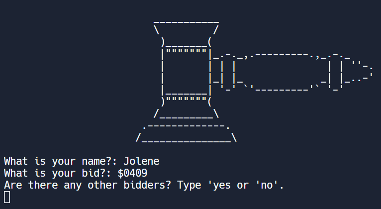

# The Silent Auction CLI Program 🤫 💵

This is the **Day 9 project** for _Dr. Angela Yu_'s wonderful **[100 Days of Code: The Complete Python Pro Bootcamp for 2023](https://www.udemy.com/course/100-days-of-code/?gclid=Cj0KCQjwxMmhBhDJARIsANFGOSvM31FtILp1iKZUsuX0H3awEE5KM7KePGdsxGZZwIv2p7J9cQZRL2EaArJHEALw_wcB)** available on [Udemy](https://www.udemy.com/).

## The MVP



The project's guidelines state that the program should be able to:
- [x] Display ASCII art 🖌️
- [x] Welcome the users 👋
- [x] Get users' names 🧑‍🤝‍🧑
- [x] Record their bids 💲
- [x] Keep going until there are no more users ➿
  - [x] Clear the screen to keep past entries secret 🤫
- [x] Calculate the winning bid and return that info 🥳

## My Stretch Goals 🏆


- [x] I wanted users to be able to enter floats as well as integers.

At first I left my `bid` variable as a `string`, with an if statement using **Regex** to check for a decimal, then converted it to a `float` or `int` as needed. But that lead to a later bug 🐞, where a bid of `123.5` was winning over one of `1075`. Strange, huh? 🤯

That lead to the discovery that the `max()` function actually compares things as `strings`, converting them to that type if necessary. Then it really compares the ASCII values.

So for the first 'digits':
```
1 = 49
1 = 49
```
Then it moved on to the next 'digit:'
```
2 = 50
0 = 48
```
So after all that I just converted the bid input to a float:
`bid = float(input("What's your bid?  $"))`
Easey-peasey!

- [x] Showing the ASCII art and welcome message to each bidder.
- [x] Capitalizing each person's name - just to be more _polite_.
- [x] Using a **loop** to keep the program running if the users entered incorrectly for the repeat question: 'Are there any other bidders?'
- [x] Displaying more ASCII art when the winning bid is declared.


## What I Learned 🧑‍🎓

### How to Clear the Terminal 💻

The tutorial suggests using `from replit import clear`, but I'm dead-set on using **VS Code**.  

Lots of Google results just give you instructions to clear your own terminal and _not the screen when running a program_. But with a bit of persistence, I found you could `import os` and call it later on with `os.system("clear")`.

### Python Regex is a _Tad_ Different from Using It in JavaScript 🐍

Not to worry, the _incomprehensible_ formulas are still the same, but it's usage varies a little!

You can do away with the **backward slashes**. Instead of JavaScript's `/\./`, Python just uses `\.`. And instead of `.match()`, I needed to use `search()`. Oh and you need to import the module.

So, _before I refactored it from my code_, I had:
```python
import re
...
bid = re.search("\.", bid)
```

## To Play 🎮

Fork your own copy, then in your terminal enter:

`python3 main.py`

1) Following the prompts, enter your name and bid for _whatever_ the prize is.
2) As long as there is another person to bid, type `y` or `no` and pass the device onto the next person.
3) When everyone has bid, so the winner!

Enjoy! 🍪
